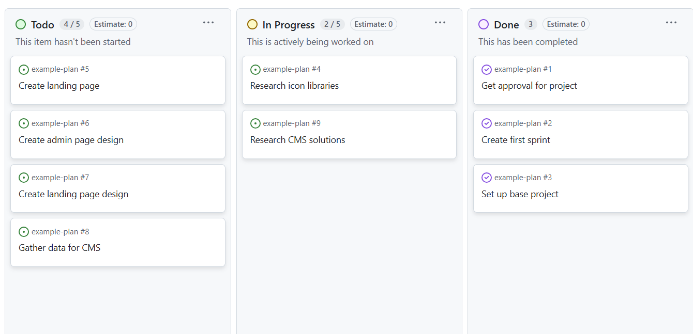

# Agency 2

This course builds on the soft skills developed in Agency 1, but now with more advanced front- end development tools and techniques including JavaScript Frameworks.

Students work in sprints to experience the working life of a developer and provides a more grounded and realistic understanding of the daily workflow of a developer.

This course provides opportunities for students to consolidate what they’ve learned but also to explore the world of front-end development further.

## Introduction

This course will put to practice your ability to work in groups, plan out a project, and complete sprints.

- Week 1: Finding a project, getting approval and creating a plan
- Week 2: Sprint 1
- Week 3: Sprint 2
- Week 4: Final touches and reflection.

As a group you should aim to have daily meetings at campus to discuss tasks for the day. If not possible for your group, you are allowed to have them online.

## Brief

You are free to create your own projects, but custom projects will need approval before the end of Thursday(13.3) as the first plan should be delivered on Monday(17.3).

Groups should preferably be 3-4 students.

**Pre approved project:**  
React frontend that consumes a headless CMS/API.

Requirements:

- Page displaying the data in a meaningful way
- Admin dashbard with functionality to
  - Add content
  - Delete content
  - Edit content

Content management systems to consider:

- Sanity
- Wordpress
- Create your own (harder)

 
 

## Process

Week one will be used to decide on a project, form groups and create a plan with estimations for the project.  
Each group will decide on a scrum master, the scrum master will be responsible for:

- Making sure tasks are distributed fairly.
- Plan meetings and take attendance.
- Send in the partial deliveries to their teacher.

Week two and three will be to carry out sprints.  
Create a short reflection for each week, with what tasks have been done and by who.

Week four will be for final touches(fixing bugs) and writing a reflection for the course.

It's recommended to have PR's approved by all members of the group, both for learning and making sure the code is correct.

## Submission

### Partial Deliveries

Partial deliveries should be sent in before 13:00 on Mondays.  
These should be relatively short, and only descriptive if there are issues blocking the group from development.

- Week 1: Project description and plan
- Week 2: Screenshot of project board and short reflection notes
- Week 3: Screenshot of project board and short reflection notes

#### Example of Partial Delivery:

> 
> Project is mostly going according to plan, we did the standup on Thursday over teams. Will create more specific tasks when we have decided on a CMS solution to use.

 

### Final submission

1. Link to github repo
1. Link to deployed site (if applicable)
1. Planning document
1. Reflection document for the project.
1. Individual relfection document.
